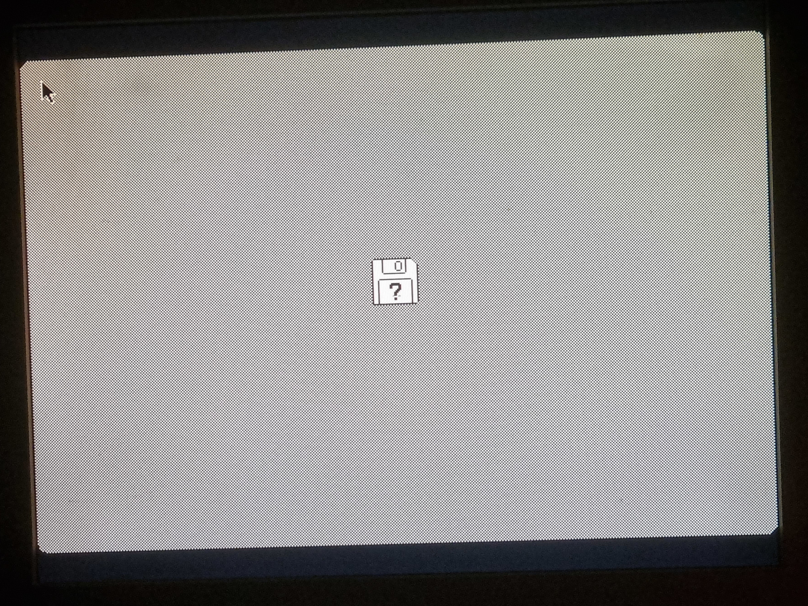
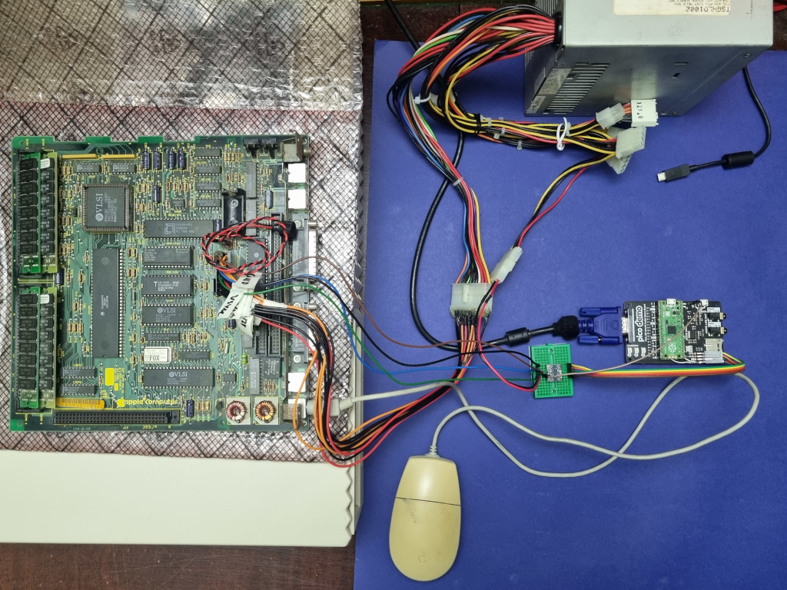
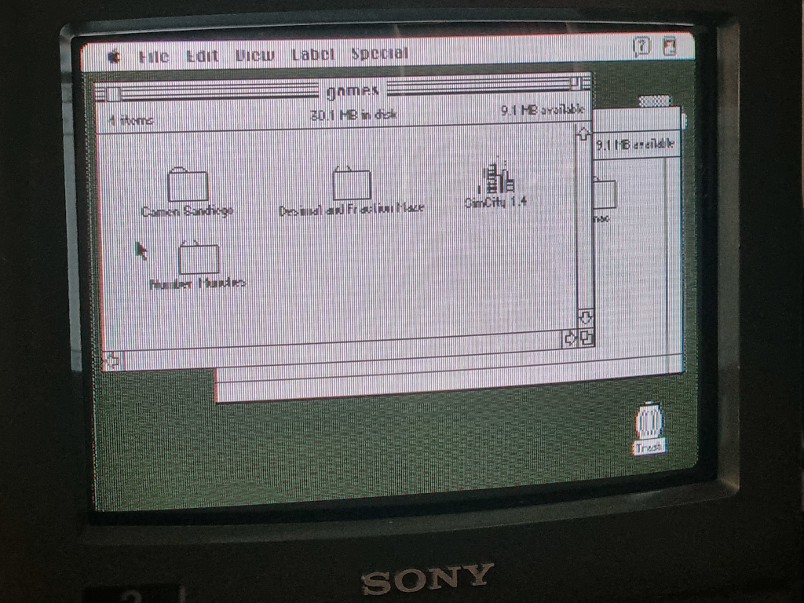
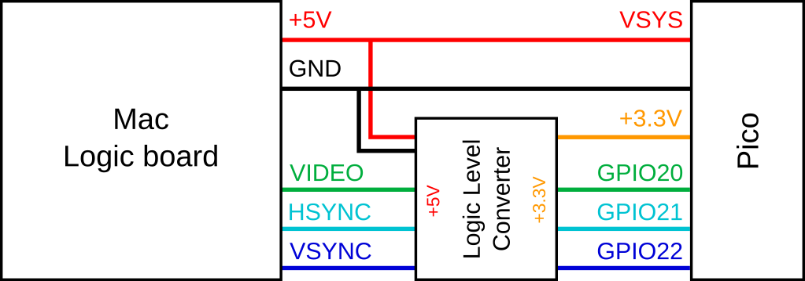
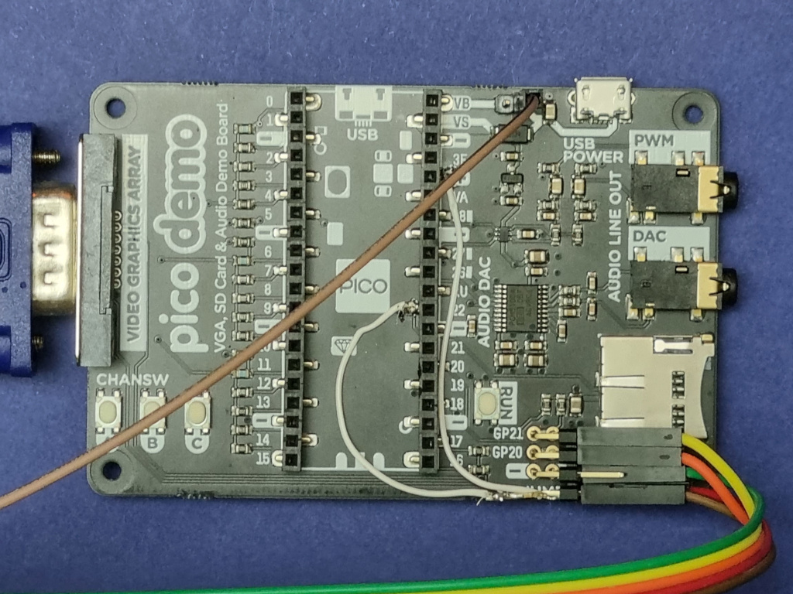
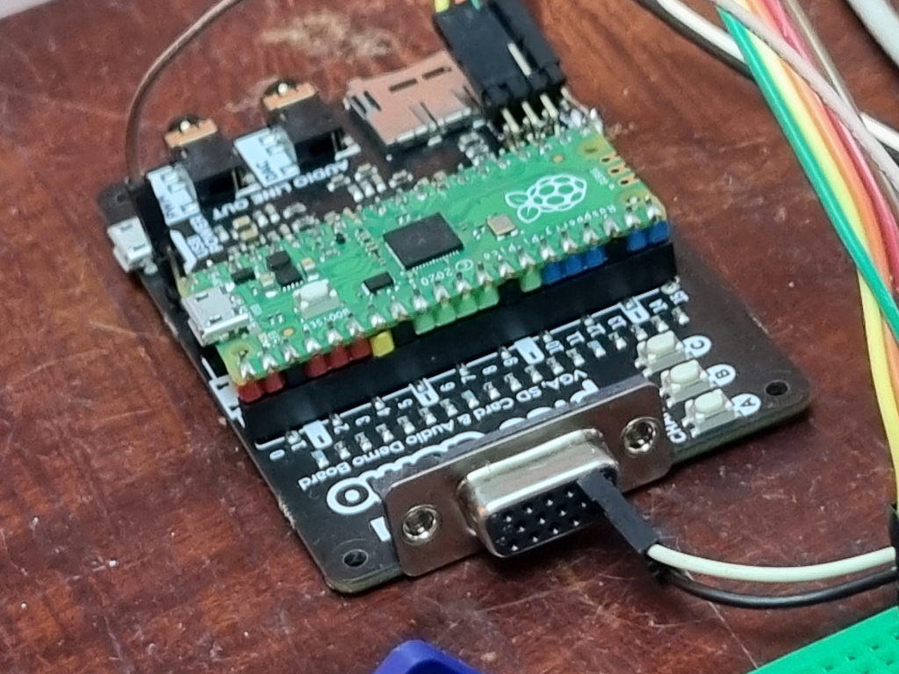

# mac-se-video-converter
Convert the video output of a Mac Plus/SE/Classic using a Raspberry Pi Pico to one of:

* A VESA compatible VGA signal.
* Monochrome composite video.

This is an active adapter that digitally reads the Mac's 512x342@60.15 and converts it. The VGA signal is to 1024x768@70.2 which should work with any VESA compatible VGA monitor. Composite video output is PAL 288p@50/576i@50 format. (Composite video should work with NTSC 480i@60 with some currently unwritten code tweaks.)

My use case for this is using an old Mac SE motherboard I have saved from back in the day. I imagine it could also be useful for if your CRT has died and can't source another, or for direct video capture.

Note, this has only been tested on a Mac SE, but the video signals should be the same.

### Screenshots/Pictures

The VGA picture on an LCD:

Wired up for VGA:

Composite video on my PVM:

(To avoid being a flickery mess, instead of interlacing progressive scan is used with every 5th line skipped.)

## Hardware Requirements
* A Raspberry Pi Pico
* A logic level converter
* A breadboard might be useful

For VGA output, a Pico VGA demo board or equivalent is needed:

* [Pimoroni Pico VGA Demo Base](https://shop.pimoroni.com/products/pimoroni-pico-vga-demo-base?variant=32369520672851)
* [pi3g](https://buyzero.de/products/raspberry-pi-pico-vga-audio-sd-expansion-board?variant=39412666335412)
* Build your own from [schematics](https://datasheets.raspberrypi.com/rp2040/hardware-design-with-rp2040.pdf)

For composite video output, a resistor digital-to-analog converter, or DAC, is needed. The code is written to use the DAC from the VGA demo board, so the easiest solution for composite video is also a VGA demo board.

### VGA on the cheap

I did this project to use my VGA demo board, but there's nothing that specifically requires it. This project can be done on the cheap with just the Pico in a bread board, the logic level converter, some resistors, and Dupont wires. I believe it would work something like this:

* One 47 Ω resistor for any one of the R/G/B GPIO pins (e.g. GPIO 4) in the schematic to convert from 3.3 V to around 1 V, with after the resistor tied to the R/G/B pins of the VGA plug.
* The 47 Ω resistor again from the HSYNC and VSYNC out GPIO pins (16 and 17).
* The rest of the wiring for the logic level conversion and video signal in would be the same, as described below.

Combined with an off-brand logic level converter, I'd guess you could build everything for less than 20 USD/GBP. (**Warning:** I haven't built this, so I don't know for sure if exactly what I've described works, but something similar should according to the VGA demo board schematics the Raspberry Pi Foundation have provided. If you do build it, let me know so I can update this!)

### Composite on the cheap

Composite video output requires a simple resistor DAC, like the one used on the VGA board. One can be built using 5 resistors with values of 8.06 kΩ, 4.02 kΩ, 2 kΩ, 1 kΩ, and 499 Ω connected to GPIO 0 through GPIO 4, with the output of all the resistors tied together.

As with VGA on the cheap, the rest of the wiring, etc., would be the same and it could all be built at very low cost.

## Software Requirements
* [Pico C SDK](https://github.com/raspberrypi/pico-sdk])
* [Pico Extras](https://github.com/raspberrypi/pico-extras)

## Usage

### Wiring

A harness or other connection to the Mac SE logic board will be needed for the VIDEO, HSYNC, VSYNC, GND, and +5V signals to be connected to the Pico. The VIDEO, HSYNC, and VSYNC signals are 5V logic, which will need to be converted to 3.3V logic for the Pico. Something like the [SparkFun Logic Level Converter](https://www.sparkfun.com/products/12009) can be used. Wire up the Mac to the HV side and the Pico to the LV side.

The wiring should look like this:

I have made a power/data harness from an old ATX power supply 20-pin cable and old motherboard ATX 20-pin connector. This rewires an older ATX power supply to provide the Mac SE motherboard with power and also break out the needed pins for video.

**Important:** It seems that there may be a few variations of the logic board connector, please make sure you have the correct pin out for your board!!!

### VGA board modifications

The VGA demo board will need to be modified slightly. These directions are with reference to the Pimoroni VGA board.

* As the Pico will be powered via the Mac's power supply, the trace between VBUS and VSYS at the top right of the board should be cut. A header can be added on the VSYS (right) side to provide power.

* A 3.3V reference voltage is needed for the logic level converter, so a small wire will need to be soldered to the '+' pad on the right hand side 20-pin connector to provide this.

* 3 digital inputs are needed. Two of these are provided by the GP21 and GP20 headers that can be soldered on, for which the traces connecting them to SDD1 and SDD2 will need to be cut and headers soldered on. The third pin can be provided by GPIO 22, which will need to be soldered onto the 22 pad of the right hand side 20-pin connector. *Note:* With this modification I'm pretty sure the SD card cannot be used at the same time as video conversion.

* A ground header will need to be soldered on.

### Composite video connection

By default, the code assumes you are using composite video output through the VGA demo board. In which case, connect the composite video signal to the VGA pin 1 (the top right most pin). A ground connection can be made on pin 6 (the right most pin on the middle row).

### Software

If you wire things up as described above, nothing special required! Just copy the `mac.uf2` file to the Pico and that's it!

If you use an alternate video input pin configuration, the pin assignments can be changed at the top of the `se.h` file.

Choice of VGA or composite video output is specified in `mac.c` by setting the define for `OUTPUT_MODE` to 0 or 1 respectively.

If you're using composite video mode, there are several options for it in `composite.h`:

* Choosing between PAL and NTSC outputs (the latter is currently not written, PRs welcome) is set using the define for `Timings`.
* The define `CONVERSION_MODE` can be set to 0 or 1 to specify half-resolution interlacing or skipping every 5 the line. Default is skipping lines as interlacing is a flickery mess.
* If a custom resistor DAC is used, `dac.pio` will need to be modified to set the `DIVISIONS_PER_VOLT` define to the equivalent DAC voltage assuming 8-bits were set and the PIO `out` instructions and the `DAC_PIN_COUNT` define changed to reflect the number of pins used by your DAC.

## Troubleshooting

The screen is flickering/tearing, is that normal?

 * Yes there is a mismatch between the 60 Hz refresh rate output from the Mac and the conversion to the 70 Hz refresh rate of the VGA, which can result in flickering/tearing. Unfortunately there's no way around this. The refresh rate mismatch is necessary in order to be able to have the underlying pixel clocks be multiples of each other, needed for the PIO clock to be divisible by the system clock of the Pico.

The colors are inverted! Black is white and white is black!

* Well that's odd, but can be corrected. Edit `lookuptable.h` to swap `0x7FFF` with `0x0000` and then rebuild.

The screen is chopped off to the left and the right.

* Are you sure your monitor is handling the VGA signal properly? You may need to adjust the geometry to center the picture correctly.

* It's possible your Mac's timings are slightly different than my Mac's. The amount of time needed to wait until picture pixel data is received can be changed in the `videoinput.pio` file. See the `pixelskiploop` assembly label. To move the picture to the left change `set y, 31` to a lower number to shift the image left. To shift the image right, copy paste the loop with a new label. To make find adjustments, remove/add `nop [5]` commands to shift left and right respectively by one pixel.

Some rows of pixel look like they're flickering side to side by a pixel or two.

* I observed this after running the full MacBench 2.0 test suite to test out my Radius Accelerator 25. I have no idea what could be the underlying issue, maybe some cycles got skipped or missed due to CPU load? A reset of my Mac SE fixed the issue.

Some pixels are flickering black, maybe in a row or column.

* There is probably a slight signal timing mismatch. In `videoinput.pio` add/remove *single* `nop` commands before the `mov y, osr` before pixel loop. By single, I mean either `nop` on its own or changing `nop [23]` to `nop [22]` or to `nop [24]`.

Some, but not all, rows of pixels are misaligned and off the screen.

* Oh dear. The code did this originally and was very difficult to fix. Try the previous fix.

* Even more oh dear. I believe the underling issue is a timing issue with the horizontal sync matching up with the PIO clock. Maybe. I'm not entirely sure how I fixed this other than by working on the PIO code in `videoinput.pio`. Try fiddling around with the `wait X pin 1` commands that wait for the horizontal sync. Maybe move it to right before the final `jmp x-- hsyncloop`. The perfect combination is out there.

The picture is rolling sideways.

* Oh dear times three. See the previous issue.

The composite video picture doesn't look good.

* Yes.

