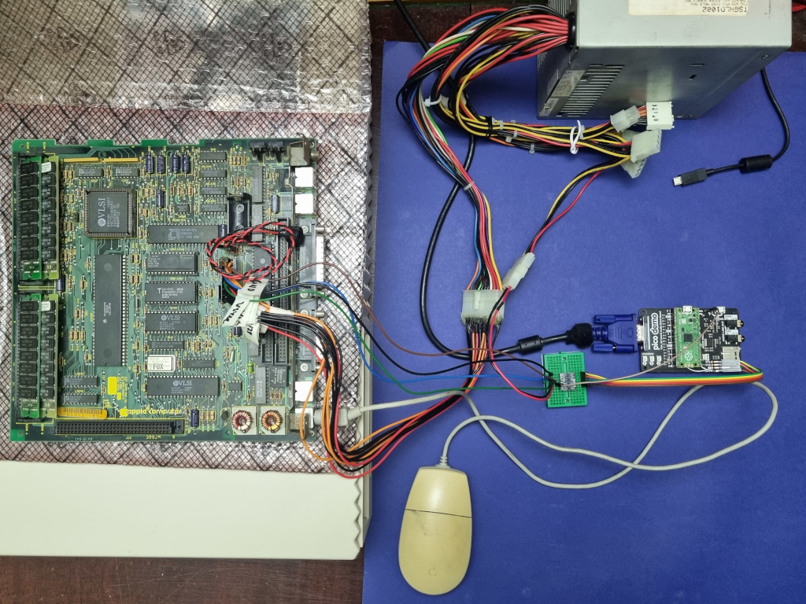
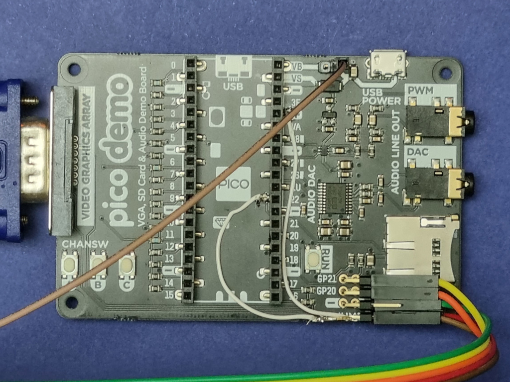

# mac-se-video-converter
Convert video from a Mac Plus/SE/Classic to VGA using a Raspberry Pi Pico. (Note: this has only been tested on a Mac SE, but the video signals should be the same.)

Takes 512x342@60.15 and converts to 1024x768@70.2.

My use case for this is using an old Mac SE motherboard I have saved from back in the day. I imagine it could also be useful for if your CRT has died and can't source another, or for direct video capture.

## Hardware Requirements
* A Raspberry Pi Pico
* A VGA demonstration board
    * [Pimoroni Pico VGA Demo Base](https://shop.pimoroni.com/products/pimoroni-pico-vga-demo-base?variant=32369520672851)
    * [pi3g](https://buyzero.de/products/raspberry-pi-pico-vga-audio-sd-expansion-board?variant=39412666335412)
    * Build your own from [schematics](https://datasheets.raspberrypi.com/rp2040/hardware-design-with-rp2040.pdf)
* A logic level converter

## Software Requirements
* [Pico C SDK](https://github.com/raspberrypi/pico-sdk])
* [Pico Extras](https://github.com/raspberrypi/pico-extras)

## Usage

### Wiring

A harness or other connection to the Mac SE logic board will be needed for the VIDEO, HSYNC, VSYNC, GND, and +5V signals to be connected to the Pico. The VIDEO, HSYNC, and VSYNC signals are 5V logic, which will need to be converted to 3.3V logic for the Pico. Something like the [SparkFun Logic Level Converter](https://www.sparkfun.com/products/12009) can be used. Wire up the Mac to the HV side and the Pico to the LV side.

The wiring should look like this:

I have made a power/data harness from an old ATX power supply 20-pin cable and old motherboard ATX 20-pin connector. This rewires an older ATX power supply to provide the Mac SE motherboard with power and also break out the needed pins for video.

**Important:** It seems that there may be a few variations of the logic board connector, please make sure you have the correct pin out for your board!!!

### VGA board modifications

The VGA demo board will need to be modified slightly. These directions are with reference to the Pimoroni VGA board.

* As the Pico will be powered via the Mac's power supply, the trace between VBUS and VSYS at the top right of the board should be cut. A header can be added on the VSYS (right) side to provide power.

* A 3.3V reference voltage is needed for the logic level converter, so a small wire will need to be soldered to the '+' pad on the right hand side 20-pin connector to provide this.

* 3 digital inputs are needed. Two of these are provided by the GP21 and GP20 headers that can be soldered on, for which the traces connecting them to SDD1 and SDD2 will need to be cut and headers soldered on. The third pin can be provided by GPIO 22, which will need to be soldered onto the 22 pad of the right hand side 20-pin connector. *Note:* With this modification I'm pretty sure the SD card cannot be used at the same time as video conversion.

* A ground header will need to be soldered on.

### Software

If you wire things up as described above, nothing special required! Just copy the `mac.uf2` file to the Pico and that's it!

If you use an alternate pin configuration, pin assignments can be changed at the top of the `se.h` file.
